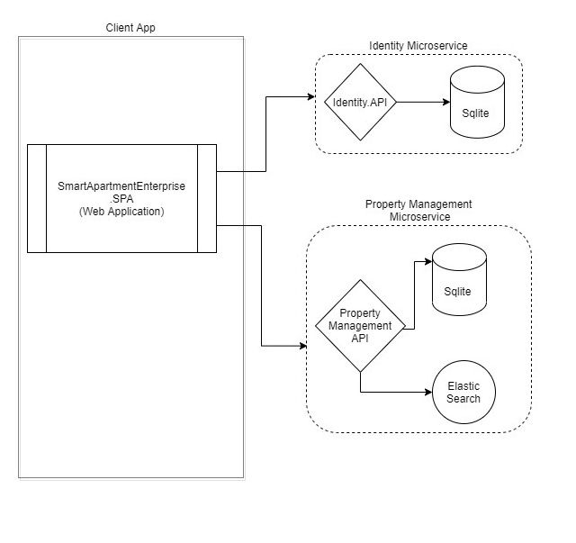
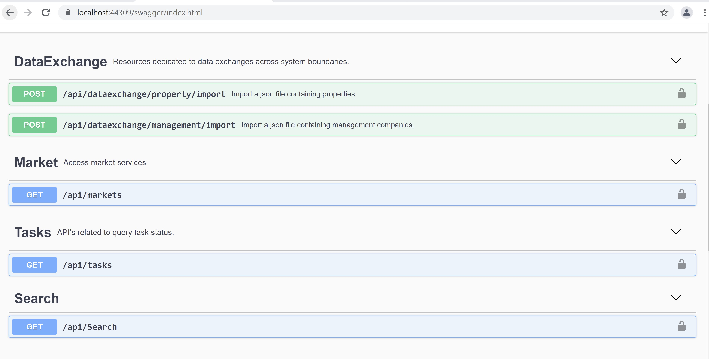
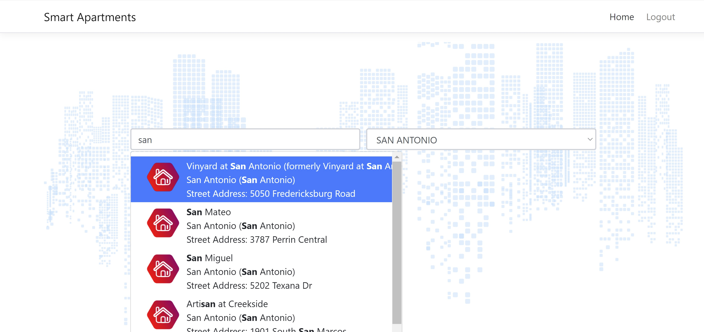

# Smart Apartment Data Assessment

This is an enterprise solution based on microservices architecture powered by .NET Core.

## Architecture



This project uses a implementation of the microservices architecture, with usage of 3 contexts to finish the assessment.

### 1.  Identity Microservice
This was built via the [IdentityServer4](https://identityserver4.readthedocs.io/en/latest/) template as a central logic and auth workflow. 
    
#### Responsibilities

- All API's exposed by `PropertyManagement.API` requires  authenticated access. This microservice has been registered as the authority for issuing, validating  for the Json Web Token (JWT) that in the `PropertyManagement.API` microservice.  
- `SmartApartmentEnterprise.SPA` uses this microservice for the login workflow.
#### Defaults
 - Runs on https://localhost:5001
  - 2 users are registered. 
    ```
    Username: alice
    Password: Pass123$
    ```
    ```
    Username: bob
    Password: Pass123$
    ```

### 2. Property Management Microservice

This microservice contains the main functionality of managing Property, Management Company and Search services. Use Swagger UI to play around with the API. Remember that the APIs need authentication.

### Responsibilities
- Upload the [properties.json](assets/properties.json) and [mgmt.json](assets/mgmt.json) via the DataExchange APIs from the Swagger UI. This registers the data to the Sqlite db and indexes it in Elastic Search.
- The WebApps will communicate with this microservice to search for properties and management companies. Currently, there is only 1 WebApp (SmartApartmentEnterprise.SPA)
### Defaults
- Run on https://localhost:44309
- Swagger ui can be accessed via https://localhost:44309/swagger/index.html


### 3. SmartApartmentEnterprise.SPA

This is just a Web Application created by the Angular + .NET Core template. Checkout the search functionality there. .




#### Defaults
- Run on https://localhost:44358