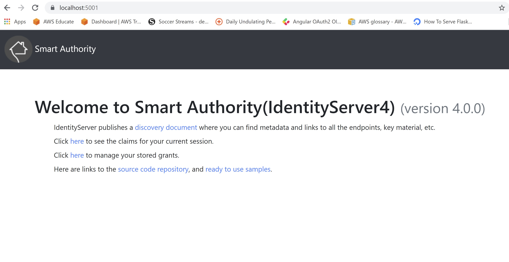

# Smart Apartment Data Assessment

This is an enterprise solution based on microservices architecture powered by .NET Core.

## Architecture


This project uses a implementation of the microservices architecture, with usage of 3 services.

### 1.  Identity Microservice
This was built via the [IdentityServer4](https://identityserver4.readthedocs.io/en/latest/) template as a central logic and auth workflow. 


#### Responsibilities

- All API's exposed by `PropertyManagement.API` requires  authenticated access. This microservice has been registered as the authority for issuing, validating the Json Web Token (JWT) used in the `PropertyManagement.API` microservice.  
- `SmartApartmentEnterprise.SPA` uses this microservice for the login workflow.
#### Defaults
 - Runs on https://localhost:5001
  - 2 users are registered. 
    ```
    Username: alice
    Password: Pass123$
    ```
    ```
    Username: bob
    Password: Pass123$
    ```

### 2. Property Management Microservice

This microservice contains the main functionality of managing Property, Management Company and Search services. Use Swagger UI to play around with the API. Remember that the APIs need authentication.

### Responsibilities
- Upload the [properties.json](assets/properties.json) and [mgmt.json](assets/mgmt.json) via the DataExchange APIs from the Swagger UI. This registers the data to the Sqlite db and indexes it in Elastic Search via a background task.
- The WebApps will communicate with this microservice to search for properties and management companies. Currently, there is only 1 WebApp (`SmartApartmentEnterprise.SPA`)
### Defaults
- Run on https://localhost:44309
- Swagger UI can be accessed via https://localhost:44309/swagger/index.html


### 3. SmartApartmentEnterprise.SPA

This is just a Web Application created by the Angular + .NET Core template. Checkout the search functionality there. .


#### Defaults
- Run on https://localhost:44358


## Running the application

After you download or clone the repository, you can run the application in these ways

### 1. Use visual studio to run each project one by one in the following order.

- Identity.API

     You will need to install dotnet-ef to seed the database with users. Use these commands to seed the database.
     ```
     dotnet tool install --global dotnet-ef
     cd src\Services\Identity\Identity.API
     dotnet run /seed
     ```
- PropertyManagment.API

    To initialize the db, use the following command
    ```
    dotnet tool install --global dotnet-ef
    cd src\Services\PropertyManagement\PropertyManagement.API
    dotnet ef database update
    ```
- SmartApartmentEnterprise.SPA

    Make sure node is installed.

### 2. Use docker compose to run the app. 

If you have docker installed, you can use docker compose to run the application. You can also use Visual Studio to run the docker compose project.

To build the docker images use the following command.
```bash
cd src
docker compose build
```

To create containers and run the app, 

```bash
 cd src
 # only create the elastic search container. This needs to run before 
 # PropertyManagement.API as indexes are created during start of PropertyManagement.API.
 docker compose up -d elasticservice
 
 # After elastic search container is functional, run all other services.
 docker compose up
```

In case you don't want the docker elastic service and want to use my AWS Elastic Service, use the following command. Currently, access to my AWS Elastic Service is protected by calls from selected IP Address. Please send me your ip address so that I can configure access.
```bash
cd src
docker compose -f .\docker-compose.yml -f .\docker-compose.aws.yml up
```

## Further development

Even though, the assessement is complete, we can add many more functionalities easily that compliments this modern architecture. However, this cannot be accomplished in a 1 week time frame. These are the few functionalities I had considered...
- API Gateway using Ocelot
- Use Message Queues like RabbitMQ or AWS SQS for asynchronous messaging.
- Centralized logging using Serilog
- Automated Tests
- Mobile Client using .NET MAUI for Search
- Github Actions for CI/CD
